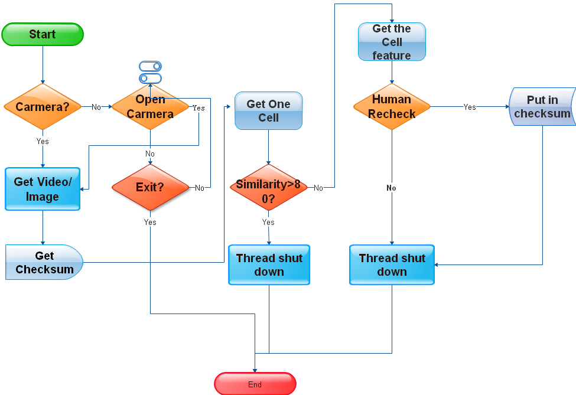

#### 基于计算机视觉信息处理的渔网生产质量检测程序
> - **Outhor** :JaikenWong 
> - **Time**: 2018-12-13 
> - **Language**: Java
> - **Enveriment**: jdk1.8 + win10 +OpenCV320
---
##### 主体思想：
 
- (1) 基于视频录像的实时获取,逐帧拆分
    - ① 摄像头的获取
    - ② 单帧图像的获取
- (2) 单帧图像的目标与背景分离
    - ① 目标物像素RGB值范围估计
    - ② 滤波将目标物和背景分离
    - ③ 分离后的图像进一步高斯模糊，去细节和锐化
    - ④ 得到渔网的具体图像
- (3) 基于Blob·分析的思想进行图像内单域几何特征提取
    - ① 并行扫描
    - ② 域内位置进行闭环检测和可达性分析
    - ③ 得到单体目标的面积角度等几何特征
    - ④ 整理正确样本分析的数据集，作校验标准
- (4) 分析图像内单体的和校验集的匹配度
    - ① 相似度匹配
    - ② 分析记录异常位置
    - ③ 进行单独几何特征提取,采集为样本
    - ④ 人工复验，判断是否合格，是加入校验集
- (5)
    - ① ...
