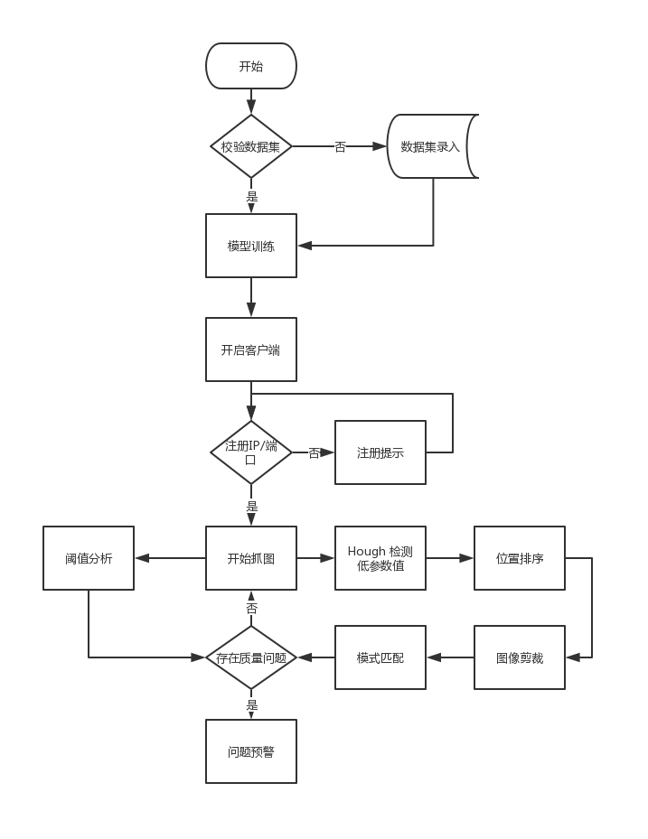

#### 基于计算机视觉信息处理的渔网生产质量检测程序
> - **Outhor** :HIT Multimedia Lab 
> - **Time**: 2018-12-13 
> - **Language**: Java
> - **Enveriment**: jdk1.8 + win10 +OpenCV320
---
##### 主体思想：
 
- (1) 基于视频录像的实时获取,逐帧拆分
    -  摄像头的获取
    -  单帧图像的获取
- (2) 单帧图像的预处理
    -  图像剪裁
    - （或）图像旋转
    -  得到渔网的具体图像
    -  参数初始化
- (3) 质量监测四个需求及预警
    -  胶点缺失
        - 方法：霍夫检测
		- 方法：Blob分析
		- 方法：自定义矩形域查找算法
    - 断线检测
        - 方法：投影降维
    -  溢胶检测
		- 模式匹配
    - 预警
- (4) 人工复查核验检测结果
- (5) 分析渔网生产质量，并生成图表和报告
##### 训练模型文件下载[地址](https://pan.baidu.com/s/1c3XCUxpq4RhHcCqH8gUOTg) ,提取码：9ze7. 
##### 数据集下载[地址](https://pan.baidu.com/s/17pq7aEnl57uyeFZOvshvWQ),提取码：n9xk .

